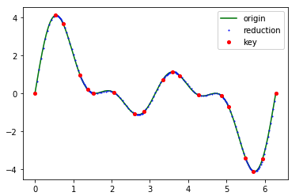

# KeyRed

语言: [English](README.md) | [中文](README_ZH.md)
------------

## 简介

Keyframe Reduction 是一个用 C 写的 Python 库。该库的主要功能是获得少量的控制点，对复杂曲线进行拟合。

主要的应用场景是动画数据的精简处理，具体的拟合效果可查看tests目录下的 [test_plot.ipynb](tests/test_plot.ipynb)。 

经过精简的动画数据，体积可减小70%～90%，具体的压缩比率与动画数据的波动频率相关。



## 安装说明 

构建：

```shell script
$ git clone https://github.com/Realibox/KeyRed.git
$ cd KeyRed
$ python3 setup.py build
```

安装：
```shell script
$ python setup.py install
```

生成的 `.so` 文件在 build 文件夹内。为了共享库可导入， `.so` 文件必须在 [PYTHONPATH](https://docs.python.org/3.7/using/cmdline.html#envvar-PYTHONPATH) 可用。

## 使用说明

```python
import animation
from math import *

data = []
n = 512
error = 0.05
for t in [x * 2 * pi / n for x in range(n + 1)]:
    data.append((t, sin(t)))

out = animation.simplify(data, error)

for i in list(range(len(out))):
    print(out[i])
```